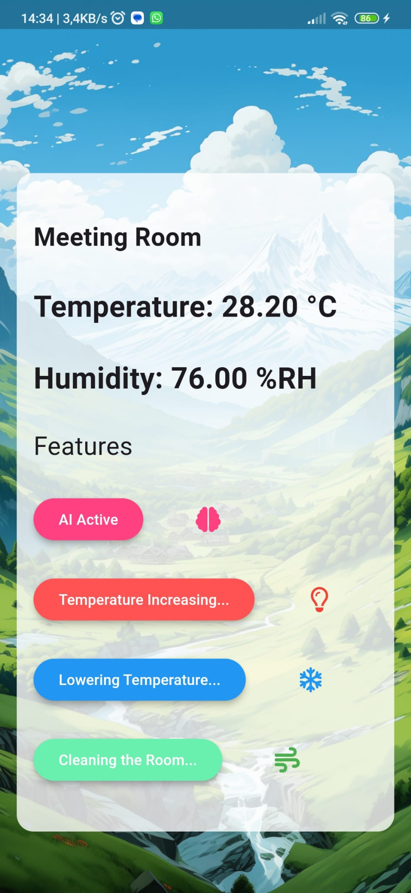
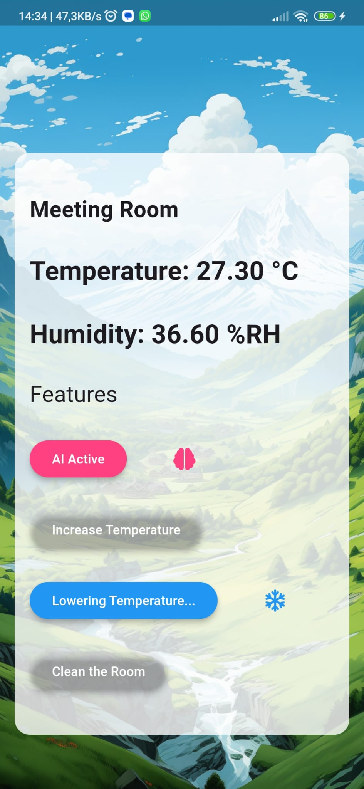
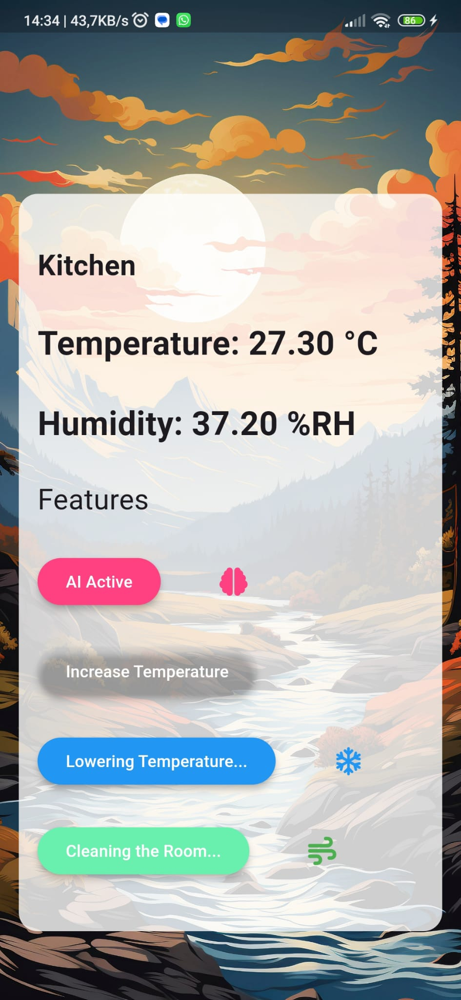
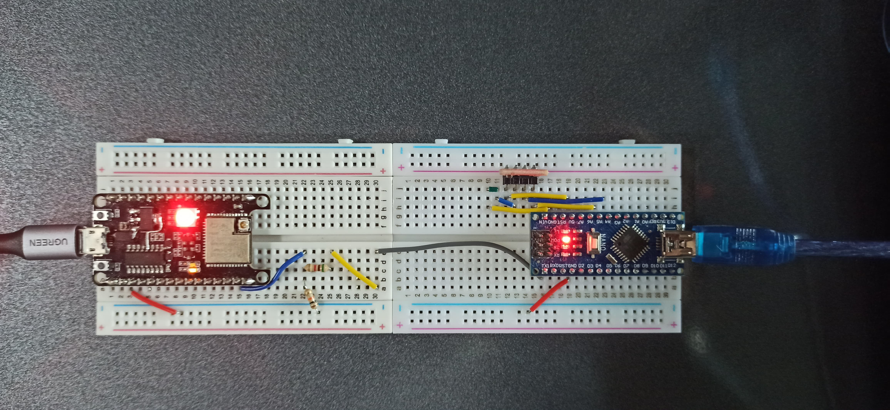
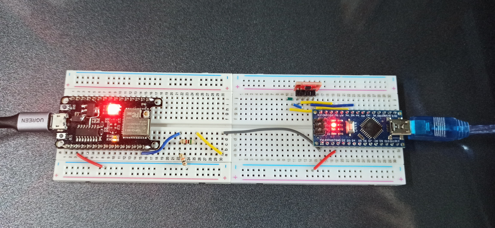
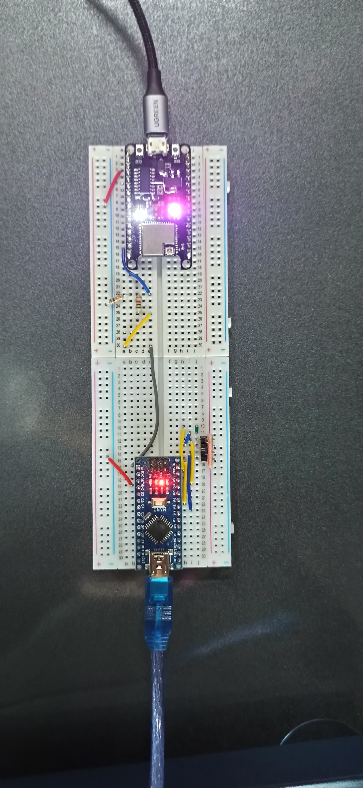
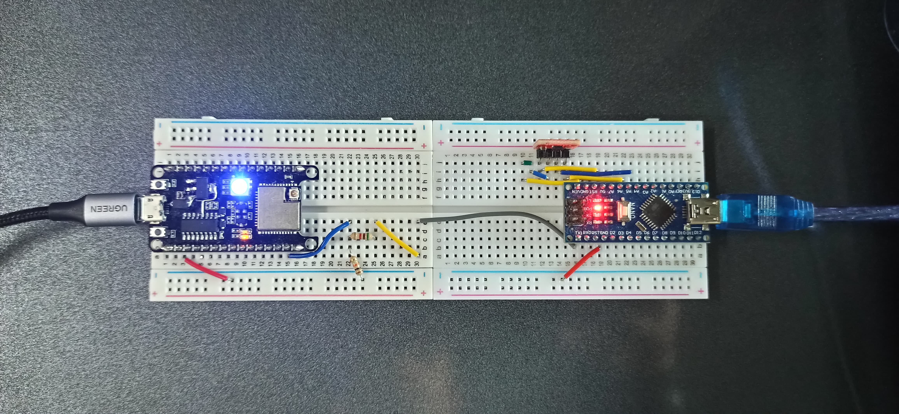

---

# ESP32 Tabanlı Akıllı Ev Kontrol Uygulaması 💡🏠

Bu proje, **Flutter** ile geliştirilmiş, **ESP32** cihazı üzerinden LED kontrolü ve gerçek zamanlı veri iletişimi sağlayan bir **Akıllı Ev Kontrol Uygulaması**dır. Uygulama, çeşitli odalar için hava durumu bilgilerini gösterirken aynı zamanda **ESP32** cihazı ile HTTP üzerinden buton kontrolleri ile LED'lerin (veya diğer donanımların) kontrol edilmesini sağlar. Proje, ESP32 tabanlı sistemler ile kablosuz olarak iletişim kurarak akıllı ev çözümleri için temel bir altyapı sunar.

## Özellikler

- **ESP32 ve Flutter Entegrasyonu**: Uygulama, ESP32 cihazına HTTP istekleri göndererek kablosuz olarak cihaz üzerinde LED kontrolü ve veri alışverişi yapar.
- **Gerçek Zamanlı Sıcaklık ve Nem Verileri**: UART üzerinden alınan sıcaklık ve nem verileri düzenli aralıklarla (3 saniyede bir) ESP32'den çekilir ve ekranda gösterilir.
- **LED Kontrolü**: Farklı butonlar aracılığıyla aşağıdaki LED işlevlerini kontrol edebilirsiniz:
  - **Yapay Zeka (AI) Modu**: AI destekli fonksiyonlar aracılığıyla çevre koşullarını izleyin ve iyileştirin.
  - **Sıcaklık Artırma**: Kırmızı LED ile sıcaklık artışı simüle edilir.
  - **Sıcaklık Azaltma**: Mavi LED ile sıcaklık azaltma işlemi gerçekleştirilir.
  - **Oda Temizleme**: Yeşil LED, odayı temizleme modunu simgeler.
- **Hava Durumu Bilgisi**: Her bir oda için sıcaklık, nem, rüzgar hızı, gün doğumu ve gün batımı gibi statik bilgileri gösterir.
- **Otomatik Güncelleme**: Veriler ESP32 cihazından her 3 saniyede bir otomatik olarak alınır ve güncellenir.
- **Kullanıcı Dostu Arayüz**: Odalar arasında sürüklenebilir kart yapısı ve sade bir arayüz ile kolay kullanım sağlar.
  
## Teknik Detaylar

- **Flutter** ile mobil arayüz geliştirilmiştir.
- **ESP32** cihazı ile HTTP tabanlı istekler üzerinden kablosuz iletişim sağlanır.
- **UART** kullanarak ESP32'den sıcaklık ve nem verileri çekilir ve ekranda gösterilir.
- **LED Kontrolü** butonlar aracılığıyla gerçekleştirilir ve bu sayede gerçek zamanlı olarak LED'lerin açılması veya kapanması sağlanır.
- **Smooth Page Indicator** ve **Animated Text Kit** kullanılarak dinamik ve modern bir arayüz sağlanır.

## Nasıl Çalışır?

1. Uygulama açıldığında, her odanın hava durumu bilgileri gösterilir ve ESP32 cihazına HTTP istekleri gönderilir.
2. Oda kontrol butonları ile LED'ler üzerinden belirli işlemler simüle edilir (örneğin, sıcaklığı artırma, azaltma veya odayı temizleme).
3. Hava durumu ve ortam verileri ESP32 üzerinden sürekli olarak güncellenir.
4. Her bir buton tıklaması, ESP32 cihazına bir HTTP isteği göndererek LED durumunu değiştirir.

## Gereksinimler

- **ESP32** (WiFi bağlantısı ile)
- **Flutter SDK** (v2.0+)
- **Dart** bilgisi

## Kurulum

1. Bu projeyi klonlayın:
   ```bash
   git clone https://github.com/username/esp32-smart-home-control.git
   ```

2. Gerekli Flutter bağımlılıklarını yükleyin:
   ```bash
   flutter pub get
   ```

3. `main.dart` dosyasındaki ESP32 IP adresini kendi cihazınıza göre güncelleyin.

4. Uygulamayı cihazınızda çalıştırın:
   ```bash
   flutter run
   ```


## Uygulama İçi Ekran Görüntüleri
                                                  

                                                


### Devre Şeması & Led Kontrolü

 

 






---
